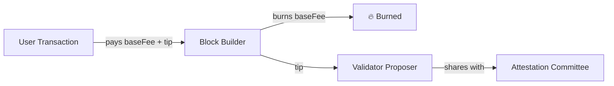
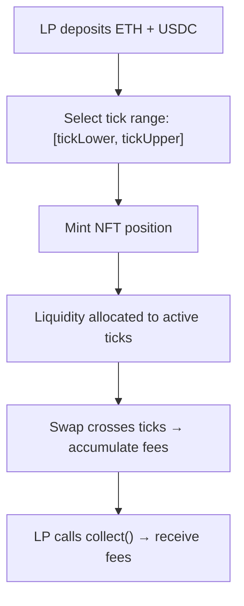
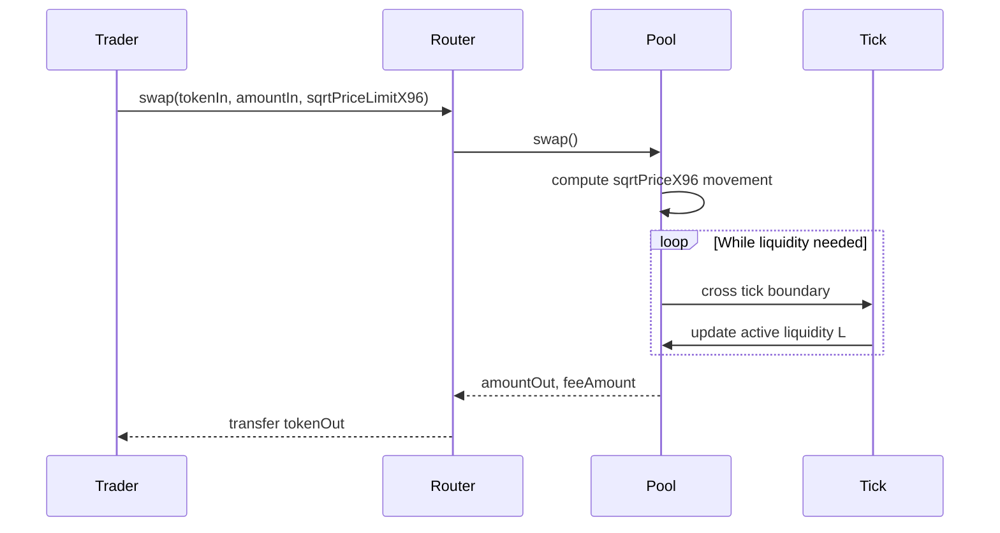
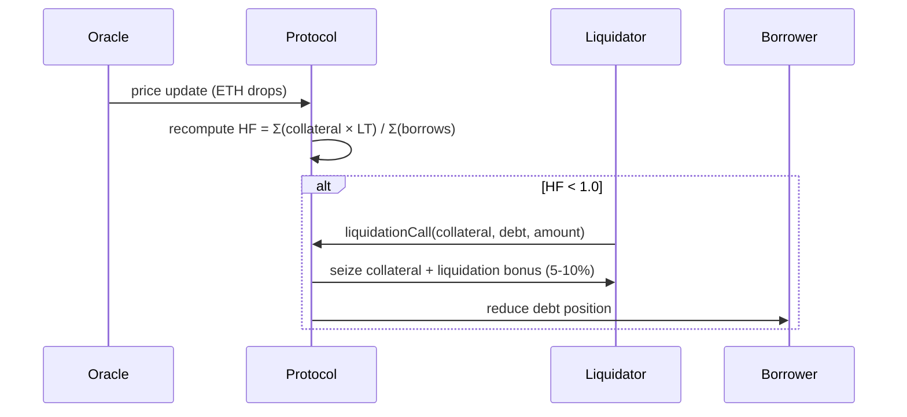

# DeFi Yield Engineering — Protocol Research Report
**Chain:** Ethereum Mainnet | **Protocols:** Uniswap V3 · Aave V3

---

## 1. Ethereum — Consensus & Tokenomics

### 1.1 Proof-of-Stake (post-Merge)
Ethereum moved from Proof-of-Work to **Proof-of-Stake** in September 2022 ("The Merge").

| Parameter | Value |
|-----------|-------|
| Validator deposit | 32 ETH |
| Slot time | 12 seconds |
| Epoch | 32 slots = ~6.4 min |
| Block proposer selection | Weighted-random by stake |
| Finality | 2 epochs (~12.8 min) |
| Slashing conditions | Double-sign, surround vote |

Validators earn **base rewards** (proportional to participation) plus **priority fees** (tips from users) and **MEV** (maximal extractable value captured via block ordering).

### 1.2 ETH Tokenomics (EIP-1559 + EIP-4844)
- **Total supply:** ~120M ETH (no hard cap, but deflationary under normal fee conditions)
- **Issuance:** ~0.5–1% annual to validators
- **Burn mechanism:** `baseFee` per EIP-1559 is burned, making ETH net-deflationary when gas demand is high
- **Staking yield:** ~3.5–4.5% APY to validators (2025 estimates)
- **Blob fees (EIP-4844):** separate fee market for L2 data blobs, reducing calldata costs ~10×



---

## 2. Uniswap V3 — AMM Architecture

### 2.1 Concentrated Liquidity

Unlike Uniswap V2 (which spreads liquidity from 0 to ∞), V3 allows LPs to concentrate liquidity in a **price range [P_a, P_b]**.

**Virtual reserves within a range:**

$$x_{virtual} = L \cdot \left(\frac{1}{\sqrt{P}} - \frac{1}{\sqrt{P_b}}\right)$$

$$y_{virtual} = L \cdot \left(\sqrt{P} - \sqrt{P_a}\right)$$

where:
- $L$ = liquidity (invariant within the range)
- $P$ = current price (token1 / token0)
- $[P_a, P_b]$ = LP's chosen tick range

**Capital efficiency** vs full-range (V2-equivalent):

$$\text{Concentration} \approx \frac{\sqrt{P_b} - \sqrt{P_a}}{\sqrt{P} - \sqrt{P_a}}$$

A ±10% range around current price yields ~**10× capital efficiency** vs full-range.

### 2.2 Tick Mathematics

Price ranges are discretised into **ticks** where:

$$P_{tick} = 1.0001^{tick}$$

The minimum tick spacing depends on fee tier:
| Fee Tier | Tick Spacing | Use Case |
|----------|-------------|----------|
| 0.01%    | 1           | Stablecoin pairs |
| 0.05%    | 10          | Correlated pairs (ETH/BTC) |
| 0.30%    | 60          | Standard pairs (ETH/USDC) |
| 1.00%    | 200         | Exotic pairs |



### 2.3 Swap Execution Flow



### 2.4 Fee Revenue Model

LP fee revenue per day:

$$\text{Fee}_{daily} = \frac{\text{Volume}_{24h} \times \text{fee\_tier} \times L_{position}}{L_{total}}$$

For a concentrated position:

$$\text{Fee}_{daily,concentrated} = \text{Fee}_{daily,full} \times \text{Concentration Factor}$$

### 2.5 Impermanent Loss

Standard IL formula (holds for V3 when price stays in range):

$$IL = \frac{2\sqrt{k}}{1+k} - 1 \quad \text{where } k = \frac{P_{new}}{P_{old}}$$

| Price change (k) | IL |
|------------------|----|
| 1.0× (no change) | 0% |
| 1.25× (+25%)     | -0.6% |
| 1.5× (+50%)      | -2.0% |
| 2.0× (+100%)     | -5.7% |
| 4.0× (+300%)     | -20.0% |

For V3, when price exits the tick range, the position becomes **100% in one asset** — no more fees, but IL accumulates.

---

## 3. Aave V3 — Lending Protocol

### 3.1 Architecture

Aave V3 is a pool-based lending protocol where:
- **Suppliers** deposit assets → receive `aTokens` (interest-bearing)
- **Borrowers** deposit collateral → borrow up to their **LTV** limit

```mermaid
graph LR
    SUPPLIER["Supplier (USDC)"] -->|deposit| POOL["Aave Pool Contract"]
    POOL -->|mint| ATOKEN["aUSDC (interest-bearing)"]
    BORROWER["Borrower"] -->|deposit collateral| POOL
    POOL -->|borrow up to LTV| BORROWER
    BORROWER -->|repay + interest| POOL
    POOL -->|supply APY| SUPPLIER

    subgraph Risk Engine
        ORACLE["Chainlink Oracle"]
        LTV["LTV 80%"]
        LT["Liquidation Threshold 85%"]
    end
    POOL --- Risk Engine
```

### 3.2 Interest Rate Model (Utilization Curve)

$$U = \frac{\text{Total Borrows}}{\text{Total Liquidity}}$$

**Two-slope model:**

$$R_{borrow} = \begin{cases}
R_{base} + U \cdot \frac{R_{slope1}}{U_{optimal}} & \text{if } U \leq U_{optimal} \\
R_{base} + R_{slope1} + (U - U_{optimal}) \cdot \frac{R_{slope2}}{1 - U_{optimal}} & \text{if } U > U_{optimal}
\end{cases}$$

For USDC on Aave V3 Ethereum: $U_{optimal}$ = 90%, $R_{slope2}$ is very steep (200%+) to punish over-utilization.

$$R_{supply} = R_{borrow} \times U \times (1 - \text{reserveFactor})$$

### 3.3 Liquidation Flow



### 3.4 Aave V3 Innovations
- **Efficiency Mode (eMode):** correlated assets can use up to 98% LTV (e.g., ETH/stETH)
- **Isolation Mode:** new assets listed with capped debt ceiling and limited collateral use
- **Portals:** cross-chain liquidity via approved bridge operators
- **GHO Stablecoin:** Aave-native stablecoin minted against collateral at governance-set rates

---

## 4. Yield Sources in DeFi

| Source | Example | Risk Level | Sustainability |
|--------|---------|------------|----------------|
| Swap fees | Uniswap V3 LP | Medium (IL) | High (organic) |
| Lending interest | Aave supply | Low | High (demand-driven) |
| Liquidity mining | DEX token rewards | High (token inflation) | Low |
| Arbitrage | Cross-protocol rate arb | Medium (gas, timing) | Medium |
| MEV | Flashloan arbitrage | Very High (technical) | Medium |

---

## 5. Risk Framework

| Risk | Description | Mitigation |
|------|-------------|-----------|
| Impermanent Loss | Price divergence erodes LP position vs HODL | Concentrated range selection, active rebalancing |
| Smart Contract Risk | Protocol bugs, reentrancy, oracle manipulation | Battle-tested protocols, audit track record |
| Liquidity Risk | Inability to exit position at fair price | High-TVL pools, multi-hop routing |
| Oracle Risk | Stale or manipulated price feeds | Chainlink TWAPs, circuit breakers |
| Gas Cost Risk | High gas erodes small position yields | Minimum capital thresholds, batch operations |
| Regulatory Risk | Protocol blacklisting, USDC freeze | Asset diversification, on-chain governance |

---

*Report generated by Crypto Crush quantitative framework.*
